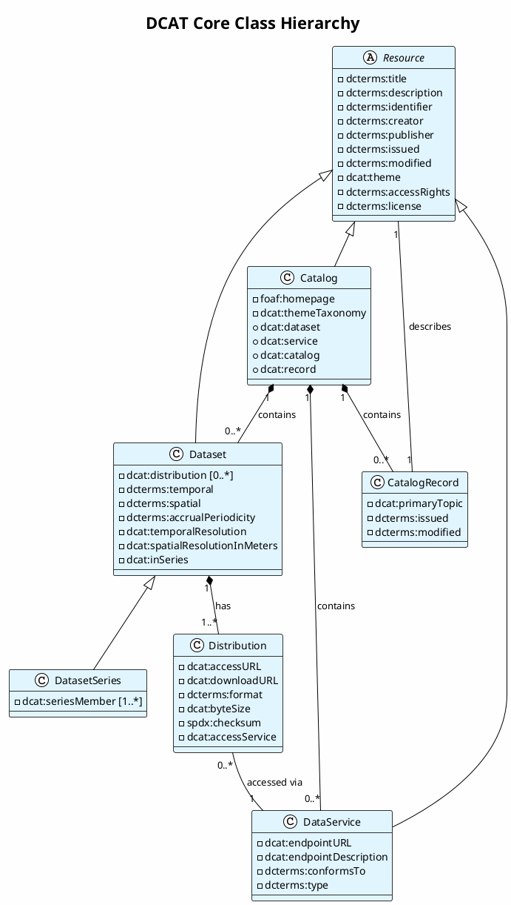
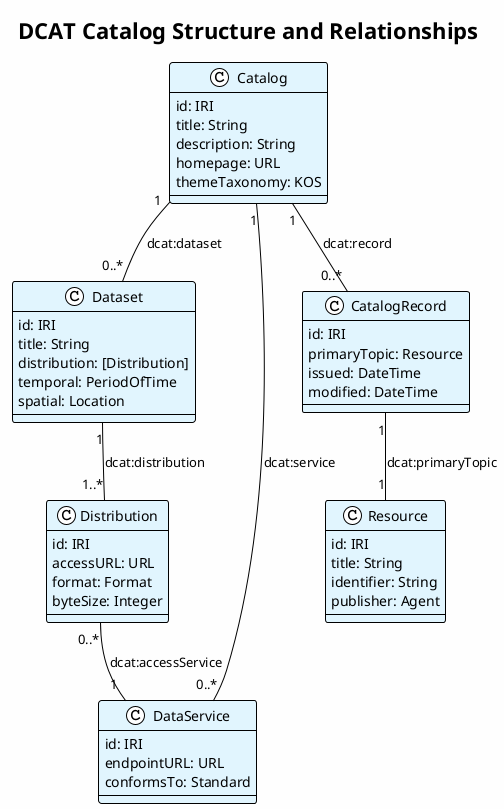
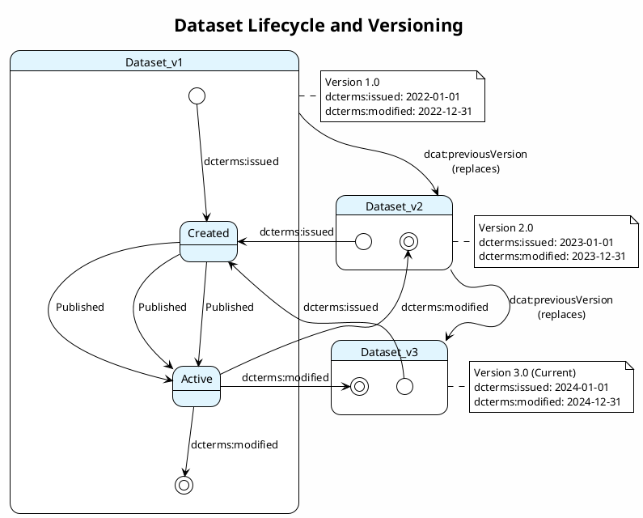
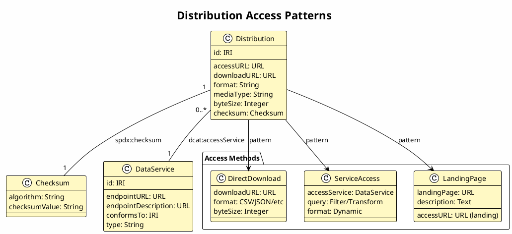
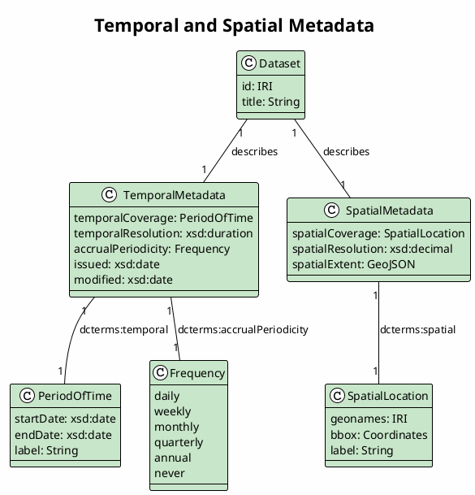
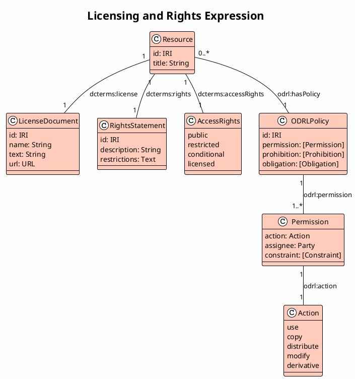
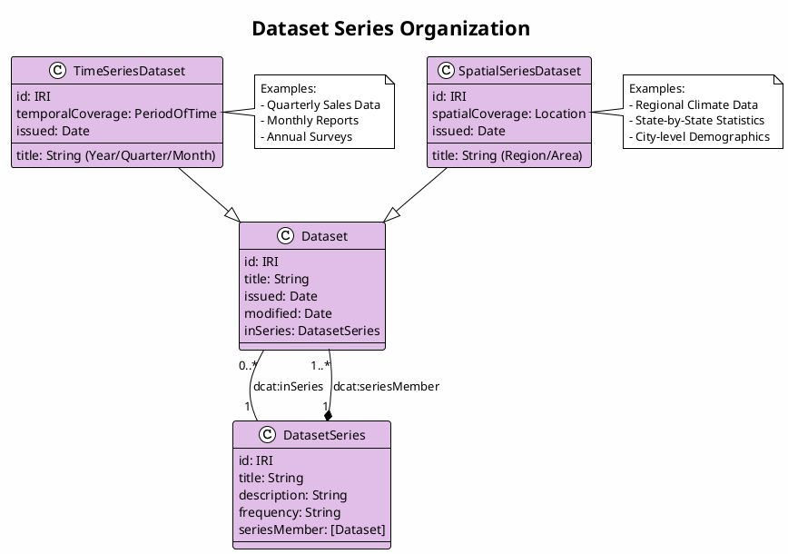
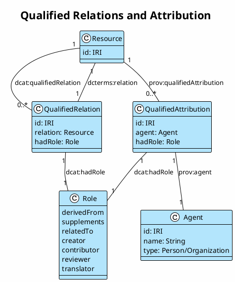
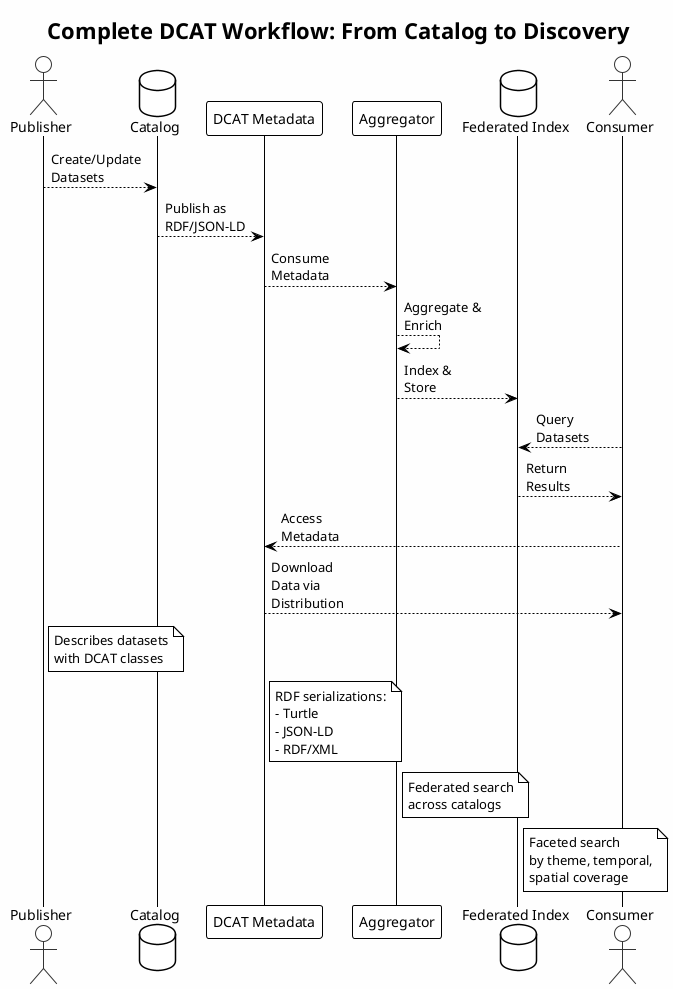

# DCAT PlantUML Diagrams & Implementation Guide

## 1. DCAT Core Class Hierarchy



## 2. DCAT Catalog Structure



## 3. Dataset Lifecycle and Versioning



## 4. Distribution Access Patterns



## 5. Temporal and Spatial Metadata



## 6. Licensing and Rights Expression



## 7. Dataset Series Organization



## 8. Qualified Relations and Attribution



## 9. Complete DCAT Workflow



---

## PostgreSQL Implementation Summary

### Key Features
- **Normalized Schema**: Fully normalized relational database design
- **ENUM Types**: Strongly-typed status and frequency fields
- **Audit Trail**: Complete change tracking with audit_log table
- **Materialized Views**: Pre-computed views for common queries
- **Stored Procedures**: PL/pgSQL functions for UPSERT operations
- **Referential Integrity**: Foreign key constraints throughout

### Main Tables
| Table | Purpose | Records |
|-------|---------|---------|
| `agents` | Persons and Organizations | Multiple per catalog |
| `resources` | Base for all DCAT resources | One per unique IRI |
| `catalogs` | Catalog containers | Multiple per system |
| `datasets` | Dataset metadata | Multiple per catalog |
| `distributions` | Dataset formats | Multiple per dataset |
| `data_services` | API endpoints | Multiple per catalog |
| `catalog_records` | Metadata about catalog entries | One per resource entry |
| `qualified_relations` | Complex relationships | Multiple |
| `qualified_attributions` | Agent responsibilities | Multiple |
| `checksums` | Distribution integrity | Multiple per distribution |

### Core Procedures
1. **upsert_resource()**: Master UPSERT for all resource types
2. **upsert_dataset()**: Dataset-specific UPSERT
3. **upsert_distribution()**: Distribution with checksums
4. **search_datasets()**: Full-text search with filters

### Query Examples

**Search datasets by title and format:**
```sql
SELECT * FROM search_datasets(
    p_search_term := 'sales',
    p_format := 'CSV',
    p_limit := 50
);
```

**View complete resource with metadata:**
```sql
SELECT * FROM v_resources_complete
WHERE resource_type = 'Dataset'
ORDER BY modified_date DESC;
```

**Track dataset versions:**
```sql
SELECT * FROM v_version_lineage
WHERE current_resource_id = 123;
```

---

## Integration Points

### 1. RDF to PostgreSQL
- Parse RDF/Turtle into resource tuples
- Call upsert procedures for each resource
- Maintain IRIs for Linked Data compatibility

### 2. PostgreSQL to RDF
- Query views for complete resource information
- Generate Turtle/JSON-LD from result sets
- Include IRIs for federation

### 3. Full-Text Search
- Use PostgreSQL full-text indexes
- Integrate with search applications
- Support federated catalog aggregation

### 4. Version Control
- Track all changes in audit_log
- Maintain version chains
- Support rollback operations

---

**Document Version:** 1.0  
**Created:** December 2024  
**Based on:** DCAT 3.0 Recommendation