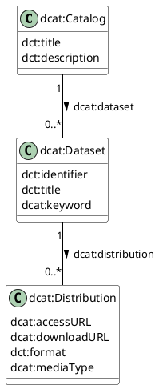
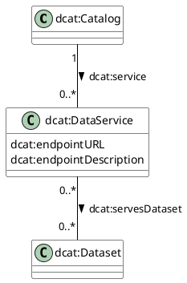
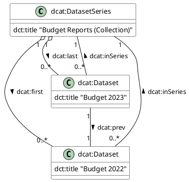
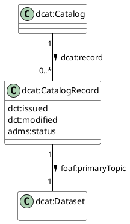

This is a comprehensive guide based on the W3C Data Catalog Vocabulary (DCAT) Version 3. Since the specification is extensive, I have structured this into the four logical pillars of DCAT: **The Core**, **Resources & Services**, **Versioning (Series)**, and **Catalog Records**.

---

# Part 1: DCAT v3 Detailed Documentation & Visuals

## Topic 1: The Core (Catalog, Dataset, Distribution)

### Summary
The core of DCAT is hierarchically organized.
1.  **Catalog (`dcat:Catalog`):** A curated collection of metadata about resources (like a library catalog).
2.  **Dataset (`dcat:Dataset`):** A collection of data, published or curated by a single agent, and available for access or download in one or more formats.
3.  **Distribution (`dcat:Distribution`):** A specific representation of a dataset. This is the actual file or API endpoint (e.g., the CSV file, the PDF report, or the JSON feed).

### Detailed Properties
*   **dcat:Catalog**
    *   `dct:title`: Name of the catalog.
    *   `dcat:dataset`: Links to the datasets contained.
    *   `dcat:service`: Links to data services contained.
    *   `dct:publisher`: The entity responsible for the catalog.
*   **dcat:Dataset**
    *   `dct:description`: Free-text account of the dataset.
    *   `dcat:distribution`: Connects the abstract dataset to specific downloadable files.
    *   `dcat:keyword`: Tags/Keywords.
    *   `dcat:theme`: Categories/Classifications.
*   **dcat:Distribution**
    *   `dcat:accessURL`: A landing page or API endpoint to access the data.
    *   `dcat:downloadURL`: A direct link to the file.
    *   `dct:format`: The file format (CSV, XML).
    *   `dcat:byteSize`: Size of the file.

### PUML Diagram: Core Model



---

## Topic 2: Data Services

### Summary
DCAT v3 places heavy emphasis on **Data Services** (`dcat:DataService`). Unlike a static file, a Data Service is a collection of operations that provides access to one or more datasets or data processing functions.

*   **Key Concept:** A Service *serves* a Dataset. This connects the API (Service) to the Data (Dataset).

### Detailed Properties
*   **dcat:DataService**
    *   `dcat:endpointURL`: The root location of the service.
    *   `dcat:servesDataset`: Connects the service to the `dcat:Dataset` it exposes.
    *   `dct:conformsTo`: Standard the API follows (e.g., GeoAPI, OpenAPI).

### PUML Diagram: Data Services



---

## Topic 3: Dataset Series (Versioning)

### Summary
New in DCAT v3 is the concept of a **Dataset Series** (`dcat:DatasetSeries`). This handles versioning and temporal sequences.
*   A **Series** is a dataset that represents a sequence of datasets (e.g., "Budget Reports" generally).
*   A **Member** is a specific version (e.g., "Budget Report 2023").

### Detailed Properties
*   **dcat:DatasetSeries** (Subclass of Dataset)
    *   `dcat:first`: Link to the first resource in the series.
    *   `dcat:last`: Link to the most recent resource.
*   **Properties for Linking**
    *   `dcat:inSeries`: Points from a specific dataset version back to the Series.
    *   `dcat:prev` / `dcat:next`: Links sibling versions.

### PUML Diagram: Versioning



---

## Topic 4: Catalog Records (Metadata about Metadata)

### Summary
Sometimes you need to track who added the entry to the catalog, distinct from who created the data.
*   **Catalog Record (`dcat:CatalogRecord`):** Describes the registration entry in the catalog, not the dataset itself. It tracks the *listing* date, *listing* status, or *listing* errors.

### Detailed Properties
*   **dcat:CatalogRecord**
    *   `foaf:primaryTopic`: Links the record to the Dataset or Service it describes.
    *   `dct:modified`: When the *metadata* was last changed.
    *   `dct:conformsTo`: Metadata standard used (e.g., "DCAT-AP 2.0").

### PUML Diagram: Catalog Record



---

# Part 2: PostgreSQL Schema

This schema maps the RDF concepts to a relational structure. We will use `TEXT` types for URIs (which serve as Primary Keys in RDF, though we will use Serial IDs for SQL efficiency and store the URI as a unique column).

```sql
-- Enable UUID extension for unique identifiers
CREATE EXTENSION IF NOT EXISTS "uuid-ossp";

-- 1. CATALOG
CREATE TABLE dcat_catalog (
    catalog_id UUID PRIMARY KEY DEFAULT uuid_generate_v4(),
    uri TEXT UNIQUE NOT NULL, -- The RDF Subject URI
    title TEXT NOT NULL,
    description TEXT,
    publisher_uri TEXT,
    homepage_url TEXT,
    language TEXT,
    issued_date TIMESTAMPTZ,
    modified_date TIMESTAMPTZ DEFAULT NOW()
);

-- 2. DATASET SERIES (For Versioning)
CREATE TABLE dcat_dataset_series (
    series_id UUID PRIMARY KEY DEFAULT uuid_generate_v4(),
    uri TEXT UNIQUE NOT NULL,
    title TEXT,
    catalog_id UUID REFERENCES dcat_catalog(catalog_id) ON DELETE CASCADE
);

-- 3. DATASET
CREATE TABLE dcat_dataset (
    dataset_id UUID PRIMARY KEY DEFAULT uuid_generate_v4(),
    uri TEXT UNIQUE NOT NULL,
    title TEXT NOT NULL,
    description TEXT,
    issued_date TIMESTAMPTZ,
    modified_date TIMESTAMPTZ,
    identifier TEXT,
    keywords TEXT[], -- Array of strings for dcat:keyword
    themes TEXT[],   -- Array of strings/URIs for dcat:theme
    landing_page_url TEXT,
    publisher_uri TEXT,
    
    -- Relationships
    catalog_id UUID REFERENCES dcat_catalog(catalog_id) ON DELETE CASCADE,
    in_series_id UUID REFERENCES dcat_dataset_series(series_id) ON DELETE SET NULL
);

-- 4. DISTRIBUTION
CREATE TABLE dcat_distribution (
    distribution_id UUID PRIMARY KEY DEFAULT uuid_generate_v4(),
    uri TEXT UNIQUE NOT NULL,
    title TEXT,
    description TEXT,
    access_url TEXT,
    download_url TEXT,
    media_type TEXT, -- IANA media type (MIME)
    format TEXT,
    byte_size BIGINT,
    license_uri TEXT,
    
    -- Relationship
    dataset_id UUID REFERENCES dcat_dataset(dataset_id) ON DELETE CASCADE
);

-- 5. DATA SERVICE
CREATE TABLE dcat_data_service (
    service_id UUID PRIMARY KEY DEFAULT uuid_generate_v4(),
    uri TEXT UNIQUE NOT NULL,
    title TEXT,
    endpoint_url TEXT NOT NULL,
    endpoint_description TEXT,
    
    -- Relationship
    catalog_id UUID REFERENCES dcat_catalog(catalog_id) ON DELETE CASCADE
);

-- Link Table: Services serving Datasets (Many-to-Many)
CREATE TABLE dcat_service_serves_dataset (
    service_id UUID REFERENCES dcat_data_service(service_id) ON DELETE CASCADE,
    dataset_id UUID REFERENCES dcat_dataset(dataset_id) ON DELETE CASCADE,
    PRIMARY KEY (service_id, dataset_id)
);

-- 6. CATALOG RECORD (Metadata about the entry)
CREATE TABLE dcat_catalog_record (
    record_id UUID PRIMARY KEY DEFAULT uuid_generate_v4(),
    uri TEXT UNIQUE NOT NULL,
    listing_date TIMESTAMPTZ DEFAULT NOW(),
    source_metadata_standard TEXT,
    
    catalog_id UUID REFERENCES dcat_catalog(catalog_id) ON DELETE CASCADE,
    primary_topic_dataset_id UUID REFERENCES dcat_dataset(dataset_id) ON DELETE CASCADE
);

-- Indexes for performance
CREATE INDEX idx_dataset_catalog ON dcat_dataset(catalog_id);
CREATE INDEX idx_distribution_dataset ON dcat_distribution(dataset_id);
CREATE INDEX idx_dataset_keywords ON dcat_dataset USING GIN(keywords);
```

---

# Part 3: Stored Procedures (Upsert Logic)

This section creates a stored procedure to update records. Since DCAT data is hierarchical, the most common operation is "Upserting" (Insert or Update) a Dataset and its Distributions.

We will use a JSON-based approach. The procedure accepts a JSON object representing a Dataset, finds the Catalog, inserts/updates the Dataset, and handles its Distributions.

### The JSON Structure Expected
```json
{
  "catalog_uri": "http://example.org/catalog/1",
  "dataset": {
    "uri": "http://example.org/dataset/weather-2023",
    "title": "Weather Data 2023",
    "description": "Temperature and percipitation...",
    "keywords": ["weather", "climate"],
    "distributions": [
      {
        "uri": "http://example.org/dist/csv",
        "access_url": "http://example.org/api/weather",
        "media_type": "text/csv"
      }
    ]
  }
}
```

### The Stored Procedure

```sql
CREATE OR REPLACE PROCEDURE upsert_dcat_dataset(
    payload JSONB
)
LANGUAGE plpgsql
AS $$
DECLARE
    v_catalog_id UUID;
    v_dataset_id UUID;
    v_dist_item JSONB;
    v_dataset_data JSONB;
BEGIN
    -- 1. Extract Dataset Data
    v_dataset_data := payload -> 'dataset';

    -- 2. Resolve Catalog ID based on URI
    SELECT catalog_id INTO v_catalog_id 
    FROM dcat_catalog 
    WHERE uri = (payload ->> 'catalog_uri');

    IF v_catalog_id IS NULL THEN
        RAISE EXCEPTION 'Catalog with URI % not found', (payload ->> 'catalog_uri');
    END IF;

    -- 3. Upsert Dataset
    INSERT INTO dcat_dataset (
        uri, 
        title, 
        description, 
        keywords, 
        catalog_id, 
        modified_date
    )
    VALUES (
        v_dataset_data ->> 'uri',
        v_dataset_data ->> 'title',
        v_dataset_data ->> 'description',
        (SELECT ARRAY(SELECT jsonb_array_elements_text(v_dataset_data -> 'keywords'))),
        v_catalog_id,
        NOW()
    )
    ON CONFLICT (uri) DO UPDATE SET
        title = EXCLUDED.title,
        description = EXCLUDED.description,
        keywords = EXCLUDED.keywords,
        modified_date = NOW()
    RETURNING dataset_id INTO v_dataset_id;

    -- 4. Handle Distributions
    -- Strategy: Delete existing distributions for this dataset not present in payload? 
    -- Or simply upsert. Here we Upsert based on Distribution URI.
    
    FOR v_dist_item IN SELECT * FROM jsonb_array_elements(v_dataset_data -> 'distributions')
    LOOP
        INSERT INTO dcat_distribution (
            uri,
            dataset_id,
            access_url,
            download_url,
            media_type,
            format,
            title
        )
        VALUES (
            v_dist_item ->> 'uri',
            v_dataset_id,
            v_dist_item ->> 'access_url',
            v_dist_item ->> 'download_url',
            v_dist_item ->> 'media_type',
            v_dist_item ->> 'format',
            v_dist_item ->> 'title'
        )
        ON CONFLICT (uri) DO UPDATE SET
            access_url = EXCLUDED.access_url,
            download_url = EXCLUDED.download_url,
            media_type = EXCLUDED.media_type,
            format = EXCLUDED.format;
    END LOOP;

    RAISE NOTICE 'Dataset % processed successfully.', (v_dataset_data ->> 'uri');

END;
$$;
```

### How to execute it

```sql
CALL upsert_dcat_dataset('
{
  "catalog_uri": "http://data.gov/catalog/main",
  "dataset": {
    "uri": "http://data.gov/dataset/001",
    "title": "US Population Density",
    "description": "Census data 2024",
    "keywords": ["census", "population"],
    "distributions": [
       {
         "uri": "http://data.gov/dataset/001/csv",
         "access_url": "http://data.gov/files/001.csv",
         "media_type": "text/csv",
         "format": "CSV"
       }
    ]
  }
}'::jsonb);
```