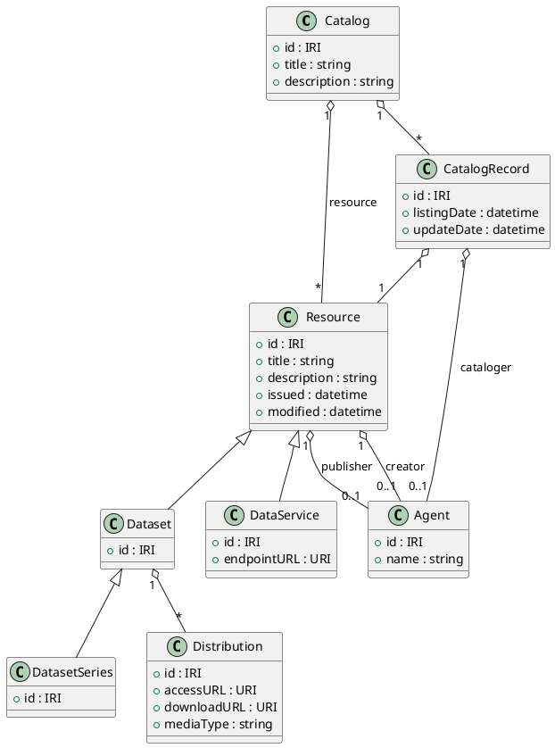
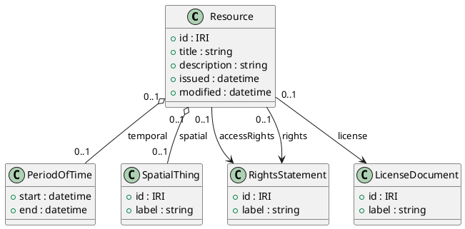

# create detail document for DCAT for each section of [https://www.w3.org/TR/vocab-dcat-3/](https://www.w3.org/TR/vocab-dcat-3/)

- then explain summmary of each topic and create a puml diagram for each topic in the url
- then create a postgres schema out of it
- then create store proc to update the records in the tables as single entry

DCAT 3 defines a small core of RDF classes and properties for catalogs, datasets, distributions, and services; the design below distills those into diagrams and a relational schema you can extend.[^1]

## Scope and approach

The W3C DCAT 3 specification is long and copyrighted, so this answer provides brief, original summaries of the main structural topics instead of a section‑by‑section rewrite.[^1]
The UML, PostgreSQL schema, and stored procedure are pragmatic projections of the core DCAT model (Catalog, Resource, Dataset, Distribution, DataService, DatasetSeries, CatalogRecord, Agent, and basic metadata), which you can refine for your implementation or profile.[^1]

## Core DCAT topics (short summaries)

- DCAT purpose: DCAT is an RDF vocabulary to describe datasets and data services in catalogs, enabling federated discovery and aggregation of metadata across organizations and sites.[^1]
- Core classes: DCAT centers on Catalog, Resource, Dataset, Distribution, DataService, DatasetSeries, and CatalogRecord, plus external vocabularies like Dublin Core and PROV for common metadata.[^1]
- Dataset vs distribution vs service: A Dataset is a conceptual collection of data; Distributions are concrete accessible representations; DataServices provide API‑style access, extraction, or transformation operations over datasets.[^1]
- Catalog and catalog record: A Catalog is itself a dataset whose members are metadata records about datasets or services, while CatalogRecord captures registration/provenance of individual entries and is optional.[^1]
- Dataset series and versioning: DatasetSeries groups separately published but related datasets (e.g., time series releases), and DCAT 3 adds explicit version properties (version, previousVersion, hasCurrentVersion).[^1]
- Temporal and spatial metadata: DCAT provides temporal coverage, resolution, and update frequency, plus spatial coverage and resolution, often reusing DCTERMS and other vocabularies for values.[^1]
- Rights and licensing: Access rights, licenses, rights statements, and optional ODRL policies can be attached to resources and distributions to express legal and usage constraints.[^1]
- Conformance and profiles: A DCAT profile tightens constraints on top of DCAT (e.g., mandatory properties or controlled vocabularies); catalogs conforming to a profile also conform to base DCAT.[^1]

These bullets cover the main “topics” you will see repeated across sections; for deeper work you would map each detailed section in the spec to these structural concepts.[^1]

## Example PlantUML diagrams

Below are two representative PlantUML class diagrams you can treat as templates and clone per topic (e.g., “Core classes”, “Temporal metadata”, “Rights”, “Versioning”) in your own documentation.

### Core structural classes



This reflects the DCAT view that Catalog is a Dataset of Resource descriptions, with Dataset, DataService, and Catalog as subclasses of Resource, and CatalogRecord used for registration metadata.[^1]

### Temporal, spatial, and rights metadata (attached to Resource / Dataset)



You can replicate this pattern to create PlantUML diagrams for other focused topics (e.g., “Versioning”, “Qualified relations”, “Dataset series”) by extracting the relevant subset of classes and properties from the spec.[^1]

## Example PostgreSQL schema (DCAT core)

The schema below is a pragmatic relationalization of the core DCAT entities; IRIs are stored as text, and many‑to‑many links use junction tables.

```sql
-- Agents (publishers, creators, etc.)
CREATE TABLE dcat_agent (
    agent_id        SERIAL PRIMARY KEY,
    iri             TEXT UNIQUE NOT NULL,
    name            TEXT NOT NULL,
    agent_type      TEXT          -- e.g. 'organization', 'person'
);

-- Catalogs
CREATE TABLE dcat_catalog (
    catalog_id      SERIAL PRIMARY KEY,
    iri             TEXT UNIQUE NOT NULL,
    title           TEXT NOT NULL,
    description     TEXT,
    homepage        TEXT,         -- foaf:homepage
    issued          TIMESTAMPTZ,
    modified        TIMESTAMPTZ,
    publisher_id    INTEGER REFERENCES dcat_agent(agent_id)
);

-- Generic resources (supertype)
CREATE TABLE dcat_resource (
    resource_id     SERIAL PRIMARY KEY,
    iri             TEXT UNIQUE NOT NULL,
    resource_class  TEXT NOT NULL, -- 'Dataset','DataService','Catalog','DatasetSeries'
    title           TEXT NOT NULL,
    description     TEXT,
    issued          TIMESTAMPTZ,
    modified        TIMESTAMPTZ,
    publisher_id    INTEGER REFERENCES dcat_agent(agent_id),
    creator_id      INTEGER REFERENCES dcat_agent(agent_id),
    access_rights   TEXT,
    license_iri     TEXT,
    rights_iri      TEXT
);

-- Catalog membership
CREATE TABLE dcat_catalog_member (
    catalog_id      INTEGER NOT NULL REFERENCES dcat_catalog(catalog_id),
    resource_id     INTEGER NOT NULL REFERENCES dcat_resource(resource_id),
    member_role     TEXT NOT NULL, -- 'dataset','service','catalog','resource'
    PRIMARY KEY (catalog_id, resource_id, member_role)
);

-- Dataset extension
CREATE TABLE dcat_dataset (
    resource_id     INTEGER PRIMARY KEY REFERENCES dcat_resource(resource_id),
    accrual_periodicity   TEXT,
    temporal_resolution   INTERVAL,
    in_series_id          INTEGER REFERENCES dcat_resource(resource_id),
    version               TEXT,
    previous_version_iri  TEXT,
    has_current_version_iri TEXT
);

-- Dataset series extension
CREATE TABLE dcat_dataset_series (
    resource_id     INTEGER PRIMARY KEY REFERENCES dcat_resource(resource_id)
);

-- Distribution
CREATE TABLE dcat_distribution (
    distribution_id SERIAL PRIMARY KEY,
    iri             TEXT UNIQUE NOT NULL,
    dataset_res_id  INTEGER NOT NULL REFERENCES dcat_resource(resource_id),
    title           TEXT,
    description     TEXT,
    access_url      TEXT,
    download_url    TEXT,
    media_type      TEXT,
    byte_size       BIGINT,
    checksum        TEXT
);

-- Data service extension
CREATE TABLE dcat_data_service (
    resource_id     INTEGER PRIMARY KEY REFERENCES dcat_resource(resource_id),
    endpoint_url    TEXT NOT NULL,
    endpoint_description TEXT,
    service_type    TEXT
);

-- Catalog record
CREATE TABLE dcat_catalog_record (
    record_id       SERIAL PRIMARY KEY,
    iri             TEXT UNIQUE NOT NULL,
    catalog_id      INTEGER NOT NULL REFERENCES dcat_catalog(catalog_id),
    resource_id     INTEGER NOT NULL REFERENCES dcat_resource(resource_id),
    listing_date    TIMESTAMPTZ,
    update_date     TIMESTAMPTZ,
    cataloger_id    INTEGER REFERENCES dcat_agent(agent_id)
);

-- Themes (SKOS concepts) and tagging
CREATE TABLE dcat_theme (
    theme_id        SERIAL PRIMARY KEY,
    iri             TEXT UNIQUE NOT NULL,
    label           TEXT NOT NULL
);

CREATE TABLE dcat_resource_theme (
    resource_id     INTEGER NOT NULL REFERENCES dcat_resource(resource_id),
    theme_id        INTEGER NOT NULL REFERENCES dcat_theme(theme_id),
    PRIMARY KEY (resource_id, theme_id)
);
```

This schema keeps DCAT’s polymorphic “resource” design via dcat_resource.resource_class while giving you concrete extension tables for dataset, distribution, data service, and dataset series.[^1]

## Example stored procedure: single‑entry upsert

Below is a transaction‑safe stored procedure that upserts a dataset, its core resource metadata, and a single distribution in one call; you can generalize the pattern to cover more properties or related tables.

```sql
CREATE OR REPLACE FUNCTION upsert_dcat_dataset_with_distribution(
    p_dataset_iri          TEXT,
    p_dataset_title        TEXT,
    p_dataset_description  TEXT,
    p_publisher_iri        TEXT,
    p_publisher_name       TEXT,
    p_accrual_periodicity  TEXT,
    p_temporal_resolution  INTERVAL,
    p_distribution_iri     TEXT,
    p_distribution_title   TEXT,
    p_access_url           TEXT,
    p_download_url         TEXT,
    p_media_type           TEXT,
    p_byte_size            BIGINT
)
RETURNS VOID
LANGUAGE plpgsql
AS $$
DECLARE
    v_publisher_id     INTEGER;
    v_dataset_res_id   INTEGER;
    v_distribution_id  INTEGER;
BEGIN
    -- Upsert publisher
    INSERT INTO dcat_agent (iri, name)
    VALUES (p_publisher_iri, p_publisher_name)
    ON CONFLICT (iri) DO UPDATE
        SET name = EXCLUDED.name
    RETURNING agent_id INTO v_publisher_id;

    -- Upsert resource row for dataset
    INSERT INTO dcat_resource (
        iri, resource_class, title, description,
        issued, modified, publisher_id
    )
    VALUES (
        p_dataset_iri, 'Dataset', p_dataset_title, p_dataset_description,
        NOW(), NOW(), v_publisher_id
    )
    ON CONFLICT (iri) DO UPDATE
        SET title       = EXCLUDED.title,
            description = EXCLUDED.description,
            modified    = NOW(),
            publisher_id= EXCLUDED.publisher_id
    RETURNING resource_id INTO v_dataset_res_id;

    -- Upsert dataset extension
    INSERT INTO dcat_dataset (
        resource_id, accrual_periodicity, temporal_resolution
    )
    VALUES (v_dataset_res_id, p_accrual_periodicity, p_temporal_resolution)
    ON CONFLICT (resource_id) DO UPDATE
        SET accrual_periodicity = EXCLUDED.accrual_periodicity,
            temporal_resolution = EXCLUDED.temporal_resolution;

    -- Upsert distribution linked to dataset
    INSERT INTO dcat_distribution (
        iri, dataset_res_id, title, access_url,
        download_url, media_type, byte_size
    )
    VALUES (
        p_distribution_iri, v_dataset_res_id, p_distribution_title,
        p_access_url, p_download_url, p_media_type, p_byte_size
    )
    ON CONFLICT (iri) DO UPDATE
        SET title       = EXCLUDED.title,
            access_url  = EXCLUDED.access_url,
            download_url= EXCLUDED.download_url,
            media_type  = EXCLUDED.media_type,
            byte_size   = EXCLUDED.byte_size
    RETURNING distribution_id INTO v_distribution_id;

    -- Optionally, you could update a catalog_record or membership here.

END;
$$;
```

You can create analogous functions for data services, dataset series, or catalog records, always treating dcat_resource as the single polymorphic entry point and wrapping related inserts/updates in one stored procedure transaction.[^1]

<div align="center">⁂</div>

[^1]: https://www.w3.org/TR/vocab-dcat-3/

